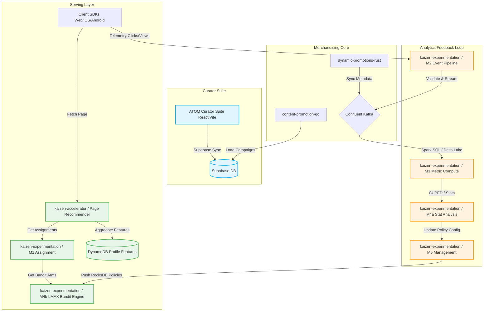

# Kaizen & Merchandising Ecosystem Architecture Overview

This document provides a high-level architectural view of the Kaizen and Merchandising ecosystem. It details the relationship and integration paths between core machine learning/experimentation engines, content merchandising APIs, and curation suites.

---

## High-Level System Topology

The ecosystem is built around three major loops:
1. **Curator Merchandising Loop (Admin Control)**: Where curators define editorial rows, dynamic promotion rules, allowlists, and key art configurations.
2. **Real-time Serving Loop (Hot-path)**: High-scale, low-latency APIs providing personalized recommendations, slate rankings, and experiment variant assignments.
3. **Closed-loop Ingest & Analytics Loop (Feedback loop)**: Capturing user events (impressions, clicks, watch time), validating schemas, streaming to Delta Lake, and performing sequential statistical CUPED calculations to evaluate performance and update bandit policies.

---

## Core Product Value Loops

### Shared audience contract and runtime ownership

`kaizen.audience.v1` is a neutral Rosetta contract. It defines portable typed
values, expression structure, operators, and diagnostics without assigning
ownership to Merchandising, Workbench, or Experimentation and without
implementing an evaluator.

Workbench's own audience evaluator may import the same contract for authoring
preview, but the schema itself is not an evaluator and preview is non-exposing.
Preview may use observed or explicitly synthetic inputs and return diagnostics,
but it neither emits nor records assignments, exposures, metrics, or rewards.
Experimentation owns production assignment behavior, including runtime
evaluation policy, deterministic bucketing, variant selection, exposure
recording, metrics, rewards, and assignment telemetry.

The checked-in `kaizen.protobuf.metadata.program.v4` files are a temporary,
reconstructed subset of an external program contract needed for current
integration compilation. They are not the final production campaign model or
the source of truth for campaign authoring. Their upstream provenance and
replacement path must be established before expanding them as a Rosetta-owned
API.

### 1. Curated Merchandising
Curators use the **ATOM Curator Suite** to configure hero banners, promotional carousels, and editorial fallbacks. Current integration builds use the temporary reconstructed `program.v4` subset to describe the external campaign boundary; that subset is not the authoring source of truth. Campaigns are parsed by `content-promotion-go` in `merchandising-apis` and synced down to the hot-path engine (`kaizen-accelerator`) so that promotional material is dynamically woven into user pages alongside personalized rows.

### 2. Real-time Personalization & Slate Bandits
When a user requests a personalized page:
1. The **Page Recommender Service** (`kaizen-accelerator`) aggregates the user's profile features from DynamoDB.
2. It requests A/B testing and bucket assignments from the **M1 Assignment Service** (`kaizen-experimentation`).
3. For slate-level contextual bandit rows, M1 orchestrates with **M4b Bandit Engine** to sample slot posterior weights (using LinUCB/Thompson Sampling) and output an optimized slate selection.
4. The page is synthesized, merged with merchandising promotion constraints, and returned to the user in under 15ms.

### 3. Loop Closure & Bayesian Policy Updates
All user activity produces telemetric logs routed to the **M2 Event Pipeline**. These are streamed through Kafka to Apache Spark (**M3 Metric Computation**) and processed into Delta Lake tables. Periodically, the **M4a Statistical Analysis** engine runs Bayesian and sequential frequentist computations (CUPED variance-reduced mSPRT tests). It feeds updated reward expectations back to the **M5 Management Service**, which re-compiles and pushes optimized policy parameters to the M4b RocksDB policy store, closing the loop.
