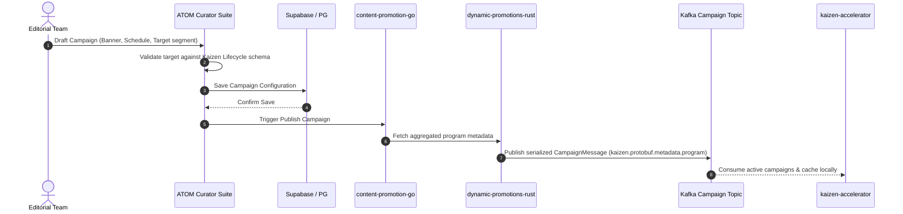
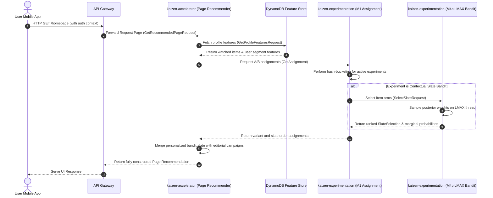
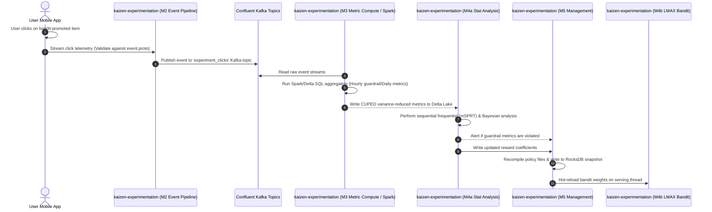

# Ecosystem Integration Flows & Contracts

This document explains the end-to-end sequence flows, messaging pathways, and telemetry routes that link curators, client SDKs, real-time recommendation gateways, and analytical computation systems.

---

## 1. Merchandising & Campaign Curation Flow

This sequence shows how an editorial team schedules a new hero promotion campaign and how it propagates to the personalized serving layers.

The `program.v4` messages currently present in Rosetta model only the temporary
reconstructed external subset needed by this integration. The external program
system remains authoritative; these files are not the final production
campaign source of truth.



---

## 2. Non-Exposing Audience Preview Flow

`kaizen.audience.v1` is neutral across authoring and runtime consumers.
Workbench's own audience evaluator can import it to preview an expression for
author feedback, while Experimentation alone owns production assignment,
exposure, metrics, and reward behavior. Preview neither emits nor records
assignments, exposures, metrics, or rewards.

```mermaid
sequenceDiagram
    autonumber
    actor Author as Workbench Author
    participant Preview as Workbench Preview
    participant Evaluator as Workbench Audience Evaluator
    participant Contract as "kaizen.audience.v1 (schema only)"
    participant Experimentation as Experimentation Runtime

    Author->>Preview: Preview expression with observed or synthetic context
    Preview->>Evaluator: Evaluate typed expression for diagnostics
    Note over Evaluator,Contract: Evaluator imports contract types; schema executes nothing
    Evaluator-->>Preview: Match result and portable diagnostics
    Preview-->>Author: Match result and diagnostics
    Note over Preview,Experimentation: Preview emits/records no assignments, exposures, metrics, or rewards
```

Preview provenance must distinguish observed values from explicitly synthetic
values. A preview result is diagnostic only and cannot be promoted into an
assignment, exposure, metric, or reward record.

---

## 3. Real-Time Personalized Page Serving Flow

This sequence shows the hot-path execution when a client SDK requests a personalized home page under A/B test assignment and slate-level contextual bandit ranking.

Unlike preview, this production flow is owned by Experimentation: it applies
runtime audience policy, creates deterministic assignments, and records
exposures and assignment telemetry.



---

## 4. Closed-Loop Telemetry Ingest & Policy Update Flow

This sequence shows how user interactions propagate through the event pipeline to trigger sequential statistical CUPED calculations, updating real-time policy algorithms.


